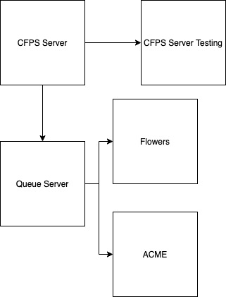

# LAB - 19

## Message Queue Server

### Author: Trevor Thompson

### Links and Resources
* [submission PR](https://github.com/trevorthompson-401-advanced-javascript/lab-20/pull/1)
* [travis](https://travis-ci.com/trevorthompson-401-advanced-javascript/lab-20)

### Setup
#### How to initialize/run your server app (where applicable)
* `npm start`
* Endpoint: /docs
  * Returns JSdocs
  
#### Tests
* Unit Tests: `npm test`
* Lint Tests: `npm run lint`

#### UML

